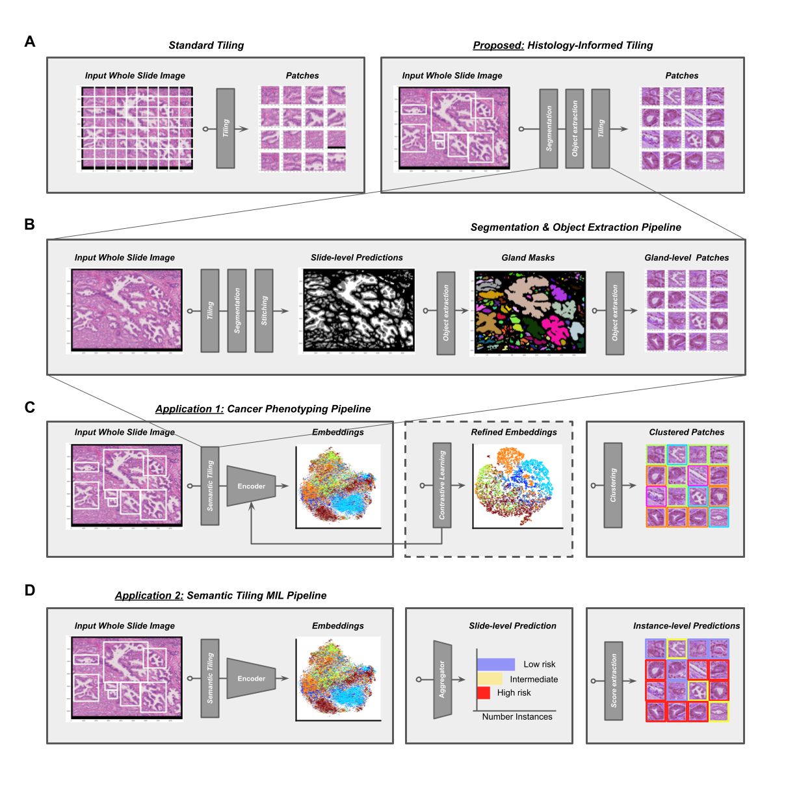

# CancerPhenotyper

## Aims

This repository contains the code to perform histology-informed tiling of whole slide images.
The methodology proceeds in three steps: 
* extracting glandular structures through semantic segmentation
* compute and cluster the embeddings of extracted glands using encoders (ViT, ResNet)
* use these embeddings to perform multiple instance learning tasks

The methodology is applied to two prostate cancer tasks: 
* predicting the risk of prostate cancer relapse in the ICGC dataset and
* detecting copy number variation in genes related to epithelial-to-mesenchymal transitions

For more details on the aims, please see the associated preprint (https://arxiv.org/abs/2511.10432).



## Setup

Run the following installs to setup the virtual environment using conda.

```bash
conda create --name cancer-phenotyper python=3.8
conda activate cancer-phenotyper
pip3 install torch torchvision
conda install -c conda-forge openslide openslide-python
conda install -c conda-forge numpy scipy pandas matplotlib seaborn scikit-learn scikit-image pillow opencv jupyterlab
```

## Repository structure

All the code is located in the `src` folder.
The code is divided into five maine folders:
* `gland-segmenter-V3`: Folder containing scripts to define, train, and apply the gland segmentation model.
* `nuclei-segmenter-V1`: Folder containing scripts to define, train, and apply the nuclei segmentation model.
* `phenotyper-V0`: Folder containing scripts to generate the embeddings of the extracted glands and perform cluster analysis.
* `multiple-instance-learning-V1`: Folder containing scripts to train multiple-instance learning models on the gland embeddings.
* `supplementary-analysis-V0`: Folder containing scripts to analyse histopathologist annotations of selected glands.

For further details see the `README.md` files in each folder.
